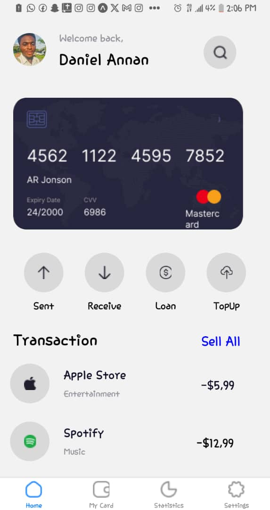
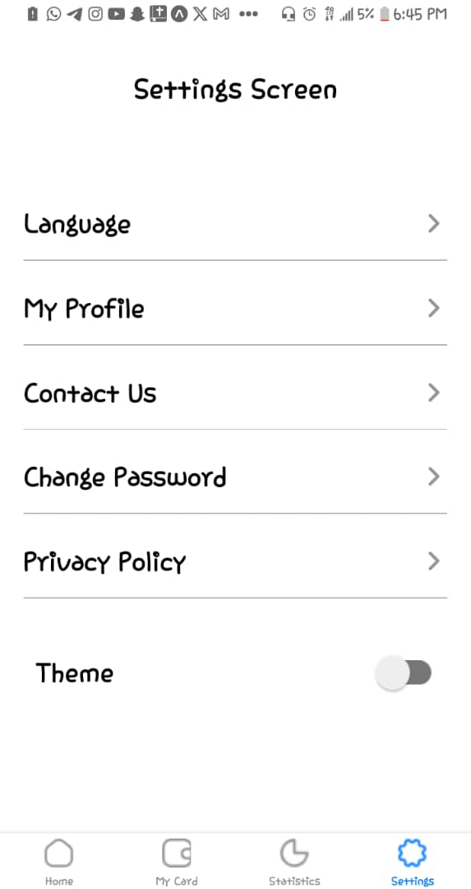

# -rn-assignment5-11116471

# My React Native Application

## Description
This application is built using React Native and features a bottom tab navigator for easy navigation across different screens. It also includes a dark mode feature that switches the theme from default to dark based on user preference.

## Screens Overview

### 1. Home Screen
- **Component:** `HomeScreen.js`
- **Description:** Displays user information and various transactional details.
- **Features:**
  - Responsive layout optimized for both light and dark themes.
  - Integrated with navigation through the bottom tab navigator.

### 2. My Card Screen
- **Component:** `MyCardScreen.js`
  - Seamlessly integrated into the bottom tab navigator for easy access.

### 3. Statistics Screen
- **Component:** `StatisticsScreen.js`
- **Features:**
  - Linked with the bottom tab navigator for effortless navigation.

### 4. Settings Screen
- **Component:** `SettingsScreen.js`
- **Description:** Allows users to customize application preferences.
- **Features:**
  - Toggle switch for switching between light and dark themes.
  - Integrated with the bottom tab navigator to maintain consistent navigation flow.

## Theme Switching
The application supports a dark mode feature where the theme transitions between light and dark based on user preference. This functionality is achieved using React Context API and state management to propagate theme changes across all screens.

## SCREENSHOT OF MY APPLICATION

  